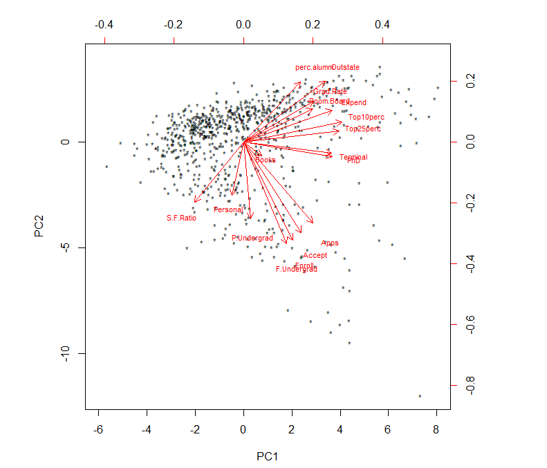
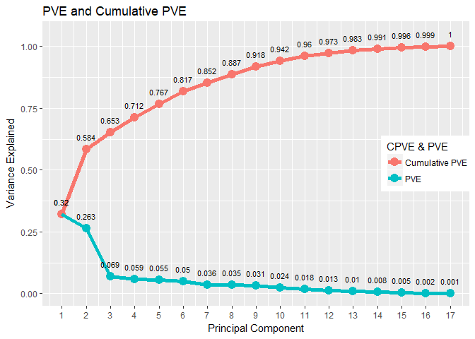
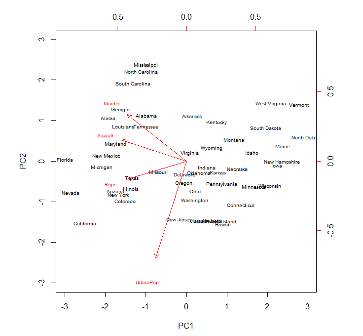
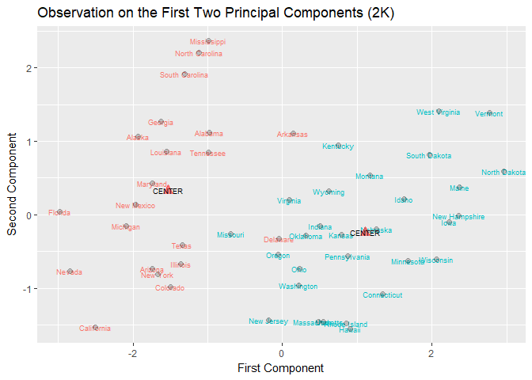
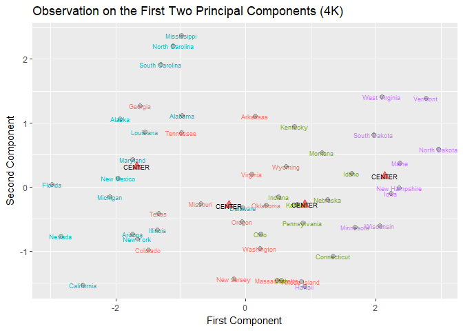
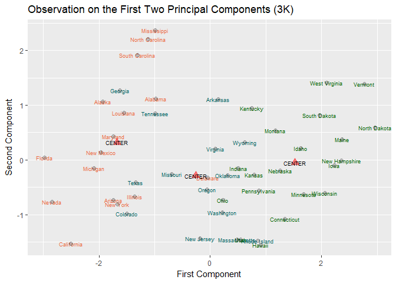
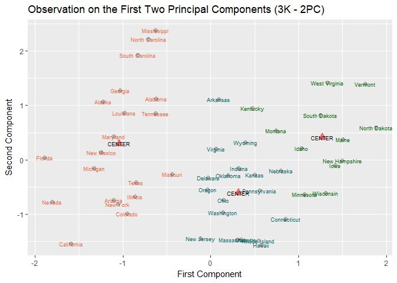
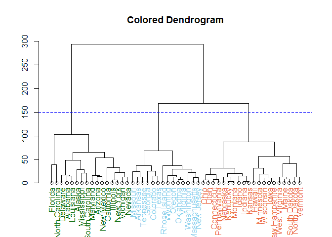
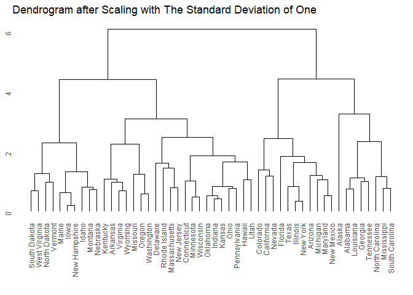

Unsupervised Learning
================
Kanyao Han

``` r
library(tidyverse)
library(forcats)
library(broom)
library(modelr)
library(stringr)
library(ISLR)
library(titanic)
library(rcfss)
library(grid)
library(gridExtra)
library(ggdendro)
library(tm)
library(knitr)
set.seed(456)
```

Part I
------

### Question 1

``` r
college <- read_csv("data/College.csv") %>% 
  select(- Private)

pr.out.college <- prcomp(college , scale = TRUE)

pr.out.college$rotation %>%
  as.data.frame() %>%
  select(PC1, PC2) %>%
  kable()
```

|             |         PC1|         PC2|
|-------------|-----------:|-----------:|
| Apps        |   0.2487656|  -0.3315982|
| Accept      |   0.2076015|  -0.3721167|
| Enroll      |   0.1763036|  -0.4037243|
| Top10perc   |   0.3542739|   0.0824118|
| Top25perc   |   0.3440013|   0.0447787|
| F.Undergrad |   0.1546410|  -0.4176738|
| P.Undergrad |   0.0264425|  -0.3150878|
| Outstate    |   0.2947364|   0.2496435|
| Room.Board  |   0.2490304|   0.1378089|
| Books       |   0.0647575|  -0.0563418|
| Personal    |  -0.0425285|  -0.2199292|
| PhD         |   0.3183129|  -0.0583113|
| Terminal    |   0.3170560|  -0.0464294|
| S.F.Ratio   |  -0.1769579|  -0.2466653|
| perc.alumni |   0.2050824|   0.2465953|
| Expend      |   0.3189088|   0.1316899|
| Grad.Rate   |   0.2523157|   0.1692405|

``` r
biplot(pr.out.college, scale = 0, cex = 0.7,
       xlabs = rep("*", nrow(college)), xlim = c(-6, 8), ylim = c(-12, 4))
```



`Top 10Percent`, `Top 25Percent`, `Expend`, `Terminal`, `PhD`, and `Outstate` appear strongly correlated on the first principal component (more than or near 0.3). `Apps`, `Accept`, `Enroll`, `F.Undergrad` and `p.Undergrad` are strongly correlated on the second principal component (more than 0.3).

### Question 2

``` r
pr.var <-  pr.out.college$sdev ^ 2
pve <-  pr.var / sum(pr.var)


pve %>% 
  cbind(c(1:17)) %>%
  as.tibble() %>%
  rename("PVE" = ".", "PC" = "") %>%
  mutate("Cumulative PVE" = cumsum(PVE)) %>%
  gather("PVE", "Cumulative PVE", key = "type", value = "pro") %>%
  mutate(pro = round(pro, 3)) %>%
  ggplot(aes(PC, pro, color = type)) +
  geom_point(size = 4) +
  geom_line(size = 2) +
  geom_text(aes(label = pro, y = pro + 0.05), color = "black", size = 3) +
  scale_x_continuous(breaks = c(1:17), limits = c(1, 17)) +
  theme(legend.position = c(0.9, 0.5)) +
  labs(title = "PVE and Cumulative PVE",
       x = "Principal Component",
       y = "Variance Explained",
       color = "CPVE & PVE")
```



Approximately 58.4% of the variance in this data is explained by the first two principal components.

Part II
-------

Question 1
----------

``` r
USArrests <- read.csv("data/USArrests.csv")


USArrests1 <- select(USArrests, - State)
row.names(USArrests1) <- USArrests$State

pr.out = prcomp(USArrests1 , scale =TRUE)
pr.out$rotation %>%
  as.data.frame() %>%
  select(PC1, PC2) %>%
  kable()
```

|          |         PC1|         PC2|
|----------|-----------:|-----------:|
| Murder   |  -0.5358995|   0.4181809|
| Assault  |  -0.5831836|   0.1879856|
| UrbanPop |  -0.2781909|  -0.8728062|
| Rape     |  -0.5434321|  -0.1673186|

``` r
biplot(pr.out , scale = 0, cex = 0.6)
```



### Question 2

``` r
k.means2 <- kmeans(USArrests1, 2, nstart = 20)
k.means3 <- kmeans(USArrests1, 3, nstart = 20)
k.means4 <- kmeans(USArrests1, 4, nstart = 20)


k2.out <- pr.out$x %>%
  as.data.frame() %>%
  select(PC1, PC2) %>%
  mutate(State = USArrests$State,
         k2 = k.means2$cluster)

k2.center <- k2.out %>%
  group_by(k2) %>%
  summarize(center1 = mean(PC1),
            center2 = mean(PC2))


ggplot(k2.out, aes(PC1, PC2)) +
  geom_text(aes(label = State, color = as.factor(k2)), size = 2.5) +
  geom_point(alpha = 0.2, size = 2) +
  geom_point(aes(center1, center2), data = k2.center, shape = 24, 
             size = 3, fill = "red", color = "red", alpha = 0.5) +
  geom_text(aes(center1, center2, label = "CENTER"), data = k2.center, size = 2.5) +
  theme(legend.position = "none") +
  labs(title = "Observation on the First Two Principal Components (2K)",
       x = "First Component",
       y = "Second Component")
```



In this 2-means clustering, the classification is predominantly based on the first principal component. Specifically, most states that are positively correlated with the first component are classified as one category and the another one contains most states that are negatively correlated with the first component. However, we can also find that Arkansas, Missouri and probably New Jersey as well as Oregon do not follow this rule. In other words, at least for some states whose correlation with the first component are very weak, other components must influence the classification, although it is difficult to tell which one/ones matter just according to this graph. Besides, the fact that two clustering centers in the graph are not strictly symmetric based on the vertical line of 0 also demontrates the previous conclusion. On the contrary, its symmerty based on the horizontal line of 0 implicate the influence of the second component.

### Question 3

``` r
k4.out <- pr.out$x %>%
  as.data.frame() %>%
  select(PC1, PC2) %>%
  mutate(State = USArrests$State,
         k4 = k.means4$cluster)

k4.center <- k4.out %>%
  group_by(k4) %>%
  summarize(center1 = mean(PC1),
            center2 = mean(PC2))


ggplot(k4.out, aes(PC1, PC2)) +
  geom_text(aes(label = State, color = as.factor(k4)), size = 2.5) +
  geom_point(alpha = 0.2, size = 2) +
  geom_point(aes(center1, center2), data = k4.center, shape = 24, 
             size = 3, fill = "red", color = "red", alpha = 0.5) +
  geom_text(aes(center1, center2, label = "CENTER"), data = k4.center, size = 2.5) +
  theme(legend.position = "none") +
  labs(title = "Observation on the First Two Principal Components (4K)",
       x = "First Component",
       y = "Second Component")
```



When it comes to 4k-means clustering, we can still conclude that the first principal component has the largest impact because most classifications rely on states' correlations with the first component. However, comparing with the result in 2k-means clustering, there are more outliers (in terms of their relationship with the first component). For example, Geogia and Colorado with a strong negative correlation with it, belong to the category that should be very weakly correlated with it. This result indicates that other components have a stronger influence in the classification. In addition, 4 clustering centers are still symmetric based on the horizontal line of 0 and thus the second component is very likely to make a difference in the classifications. We can speculate that the outlier Hawaii may be caused by it because they have a considerably correlation.

### Question 4

``` r
k3.out <- pr.out$x %>%
  as.data.frame() %>%
  select(PC1, PC2) %>%
  mutate(State = USArrests$State,
         k3 = k.means3$cluster)

k3.center <- k3.out %>%
  group_by(k3) %>%
  summarize(center1 = mean(PC1),
            center2 = mean(PC2))


ggplot(k3.out, aes(PC1, PC2)) +
  geom_text(aes(label = State, color = as.factor(k3)), size = 2.5) +
  geom_point(alpha = 0.2, size = 2) +
  geom_point(aes(center1, center2), data = k3.center, shape = 24, 
             size = 3, fill = "red", color = "red", alpha = 0.5) +
  geom_text(aes(center1, center2, label = "CENTER"), data = k3.center, size = 2.5) +
  scale_color_manual(values = c("dark green", "#036564", "#EB6841")) +
  theme(legend.position = "none") +
  labs(title = "Observation on the First Two Principal Components (3K)",
       x = "First Component",
       y = "Second Component")
```



The result in 3k-mean clustering can also be described in the same logic. Comparing to 2k-mean and 4k-mean clustering, the number of ourliers for the first component is larger than the former and smaller than the latter. It indicates that this algorithm relies more on the first component when the k is smaller. Besides, the mean of the ylab values of three clustering centers are nearly 0. It further indicates the influence of the second component.

### Question 5

``` r
k3.pc <- pr.out$x %>%
  as.data.frame() %>%
  select(PC1, PC2)

pr.out2 <- prcomp(k3.pc, scale = TRUE)

k2.means3 <- kmeans(k3.pc, 3, nstart = 20)

k3.out2 <- pr.out2$x %>%
  as.data.frame() %>%
  select(PC1, PC2) %>%
  mutate(State = USArrests$State,
         k3 = k2.means3$cluster,
         PC2 = PC2 * - 1)

k3.center2 <- k3.out2 %>%
  group_by(k3) %>%
  summarize(center1 = mean(PC1),
            center2 = mean(PC2))


ggplot(k3.out2, aes(PC1, PC2)) +
  geom_text(aes(label = State, color = as.factor(k3)), size = 2.5) +
  geom_point(alpha = 0.2, size = 2) +
  geom_point(aes(center1, center2), data = k3.center2, shape = 24, 
             size = 3, fill = "red", color = "red", alpha = 0.5) +
  geom_text(aes(center1, center2, label = "CENTER"), data = k3.center2, size = 2.5) +
  scale_color_manual(values = c("#EB6841", "dark green", "#036564")) +
  theme(legend.position = "none") +
  labs(title = "Observation on the First Two Principal Components (3K - 2PC)",
       x = "First Component",
       y = "Second Component")
```



Compared to the results of 3k-means clustering based on raw data, this graph shows a stronger clustering to three centers in all categories and a larger influence of the first component than that in the raw data. As the consequence, the categorical boundaries become more clear and there are almost no outliers. However, it does not necessarily mean that this result is more efficient or inefficient than the algorithm based on the raw data. On one hand, the first step of PCA is orthogonal projection of the data onto a lower dimensional linear space. It thus means the loss of original information in every component. What's more, when we abandon some components for dimensionality reduction, more informaion is missing. Especially for clustering, less information implicates simplified indicators and thus clearer boundries (seemingly beautiful results) but sometimes lower utility. However, on the other hand, if there are too much variables, it does not only explictly indicate the malfunction of matrix operation, but also implicates lots of noises. Therefore, if PCA can reduce enough errors caused by multicollinearity in matrix operation and noises in data, the efficiency can be improved. In this data, since there are only 4 very clear variables and consequently 4 components, both dimentionality reduction and component selection are not wise choices, although they do bring a fraudulent "good" result.

### Question 6

``` r
hc.complete <- hclust(dist(USArrests1), method = 'complete')
ggdendrogram(hc.complete) +
  labs(title = "Basic Dendrogram without Scaling the Variables")
```


### Question 7

``` r
labelColors = c("dark green", "sky blue", "#EB6841")

clusMember = cutree(hc.complete, 3)

colLab <- function(n) {
    if (is.leaf(n)) {
        a <- attributes(n)
        labCol <- labelColors[clusMember[which(names(clusMember) == a$label)]]
        attr(n, "nodePar") <- c(a$nodePar, lab.col = labCol)
    }
    n
}

hcd = as.dendrogram(hc.complete)
clusDendro = dendrapply(hcd, colLab)

plot(clusDendro, main = "Colored Dendrogram")
par(new = TRUE)
abline(h = 150, lty = 2, col = "blue")
```



Cluster 1: Florida, North Carolina, Delaware, Alabama, Louisiana, Alaska, Mississippi, South Carolina, Maryland, Arizona, New Mexico, California, Illinois, New York, Michigan, Nevada (16)

Cluster 2: Missouri, Arkansas, Tennessee, Georgia, Colorado, Texas, Rhode Island, Wyoming, Oregon, Oklahoma, Virgina, Washington, Massachusetts, New Jersey (14)

Cluster 3: Ohio, Utah, Connecticut, Pennsylvania, Nebraska, Kentucky, Montana, Idaho, Indiana, Kansas, Hawaii, Minnesota, Wisconsin, Iowa, New Hampshire, West Virginia, Maine, South Dakota, North Dakota, Vermont (20)

### Question 8

``` r
standard.areest <- USArrests1 %>%
  scale()

hc.standard <- hclust(dist(standard.areest), method = 'complete')
ggdendrogram(hc.standard) +
  labs(title = "Dendrogram after Scaling with The Standard Deviation of One")
```



First, after scaling, the structure has changed. We can easily identify four main clusters rather than three in the previous graph. Second, the hierarchy become more comparable in current graph since all variables' scales are standardized. In the previous graph, larger scale variables such as Assault will have a large contribution to the hierarchy so that the importances of variables with small scales are suppressed. The best example is Alaska. Almost all of its variables are vastly different from other states. However, in the previous graph, just because its Assault arrest number is smaller than a very limited number of states, the importance of Alaska's other features is suppressed.
